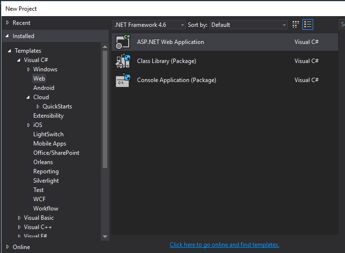
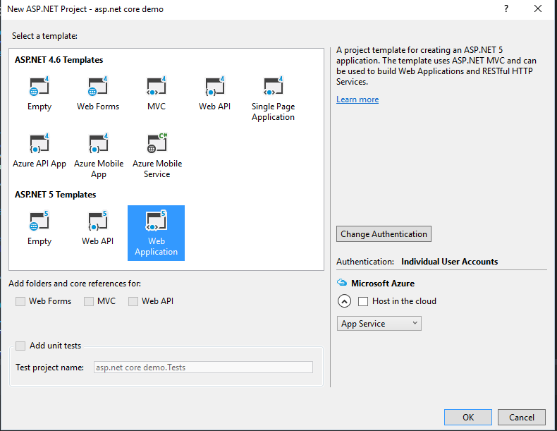
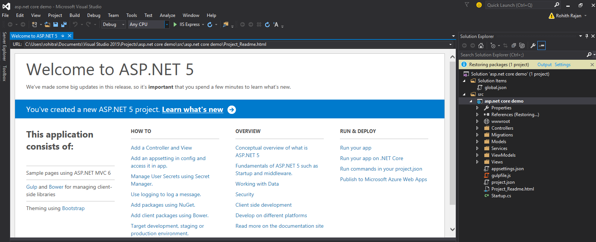
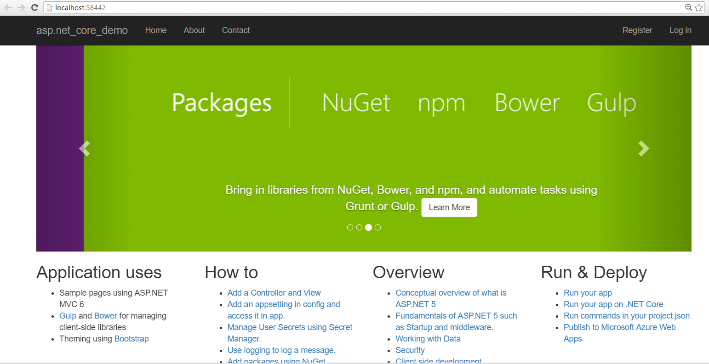

# Create ASP.NET Core Project in Visual Studio

CREATE YOUR FIRST ASP.NET CORE PROJECT IN VISUAL STUDIO
Select the ASP.NET Web Application project template. It appears under Installed > Templates > Visual C# > Web

IN THE NEW ASP.NET PROJECT DIALOG, SELECT WEB APPLICATION UNDER ASP.NET 5 PREVIEW TEMPLATES. ALSO, MAKE SURE THE HOST IN THE CLOUD CHECKBOX IS NOT SELECTED AND CLICK OK.

###RUNNING AND DEBUGGING YOUR ASP.NET CORE APP

Once Visual Studio finishes creating the app, run the app by selecting Debug -> Start Debugging . As an alternative, you can press F5.

