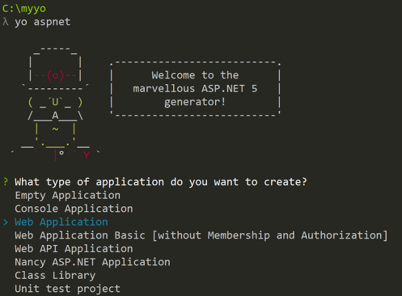

# New ASP.NET Core project using Yeoman and VS Code

###Prerequisites

```
//Install Node.js, npm, and Yeoman
npm install -g yo bower grunt-cli gulp
```

###install the ASP.NET generator

```
npm install -g generator-aspnet
//The –g flag installs the generator globally, so that it can be used from any path.
```

###Create an asp.net app directory

```
mkdir C:\Myaspnetcore
cd C:\Myaspnetcore
```

###Run the ASP.NET generator for yo

```yo aspnet```


###The generator displays a menu. Arrow down to the Web Application project and tap Enter:




