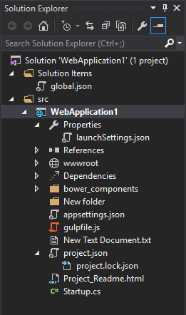
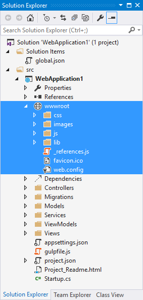

# Understanding Application Structure

ASP.NET CORE PROJECT STRUCTURE



PROJECT.JSON FILE

```
{
  "version": "1.0.0-*",
  "compilationOptions": {
    "emitEntryPoint": true
  },

  "dependencies": {
    "Microsoft.AspNet.IISPlatformHandler": "1.0.0-rc1-final",
    "Microsoft.AspNet.Server.Kestrel": "1.0.0-rc1-final"
  },

  "commands": {
    "web": "Microsoft.AspNet.Server.Kestrel"
  },

  "frameworks": {
    "dnx451": { },
    "dnxcore50": { }
  },

  "exclude": [
    "wwwroot",
    "node_modules"
  ],
  "publishExclude": [
    "**.user",
    "**.vspscc"
  ]
}

```

###PROJECT.JSON FILE

* define the dependencies(references)
* allows you to configure commands that can be run from a command line
* target frameworks
* manage client side packages
* and many more...


###Global.Json file

The global.json file is used to configure the solution as a whole. It includes just two sections, projects and sdk by default.

```
{
  "projects": [ "src", "test" ],
  "sdk": {
    "version": "1.0.0-rc1-update1"
  }
}
```

projects property designates which folders contain source code for the solution.y default the project structure places source files in a src folder, allowing build artifacts to be placed in a sibling folder, making it easier to exclude such things from source control.


###WWWROOT FOLDER 

wwwroot folder represents the actual root of the web app when running on a web server. Static files, like appsettings.json, which are not located in wwwroot will never be accessible, and there is no need to create special rules to block access to sensitive config files



